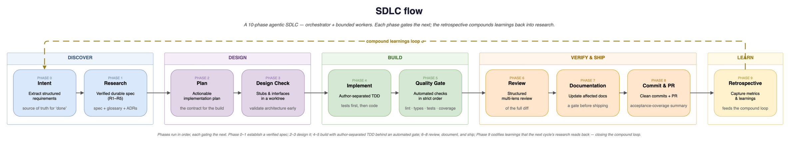

# ADE — Agentic Development Environment

A Python bootstrapper that scaffolds AI-driven SDLC skills and subagent definitions for [Claude Code](https://claude.com/claude-code), Gemini CLI, GitHub Copilot, and OpenAI Codex.

`ade init --agent <harness>` generates per-harness skills trees (one `SKILL.md` per phase + `ade-pipeline` driver), worker subagent definitions, deterministic hook wiring, the shared `AGENTS.md` root instruction file, `.ade/` user-config, and bootstrap project documentation (`CONTEXT.md`, `docs/adr/`, `docs/specs/`, `docs/learnings/`). The selected harness is the runtime — ADE does not run agents, execute code, or manage state.

The pipeline runs a **9-phase SDLC (Phases 0–9)** with Opus as orchestrator and Sonnet/Haiku worker subagents. Its signature properties: blast-radius **routing** that scales ceremony to change size, **author-separated TDD** (the agent that writes the tests is never the one that writes the code), a **deterministic hook layer** that gates commit integrity off the model loop, and a **compound loop** that codifies each task's learnings for the next one.

## What it generates

`ade init --agent all` (all four harnesses) produces:

```
your-project/
├── .claude/
│   ├── agents/                        # 12 worker defs (model + tools in frontmatter) — .md
│   ├── skills/                        # Phase skills — SKILL.md folders
│   │   ├── ade-intent/SKILL.md        # Phase 0 — intent + routing
│   │   ├── ade-research/SKILL.md      # Phase 1 — R1–R5 research
│   │   ├── ade-plan/SKILL.md          # Phase 2 — implementation plan
│   │   ├── ade-design-check/SKILL.md  # Phase 3 — stubs in worktree
│   │   ├── ade-implement/SKILL.md     # Phase 4 — author-separated TDD
│   │   ├── ade-quality-gate/SKILL.md  # Phase 5 — lint/format/tests
│   │   ├── ade-review/SKILL.md        # Phase 6 — multi-aspect review
│   │   ├── ade-docs/SKILL.md          # Phase 7 — documentation updates
│   │   ├── ade-ship/SKILL.md          # Phase 8 — commit + PR
│   │   ├── ade-retro/SKILL.md         # Phase 9 — retro + codify
│   │   ├── ade-pipeline/SKILL.md      # End-to-end driver (user-invoked, Phases 0→9)
│   │   ├── ade-pr-review/SKILL.md     # GitHub PR review-and-fix loop
│   │   └── grill-with-docs/SKILL.md  # Vendored (MIT, attributed)
│   ├── hooks/                         # Deterministic commit-integrity hooks (Python)
│   │   ├── block-mixed-commit.py      # blocks commits mixing tests + impl (Phase 4)
│   │   ├── check-leftover-stub.py     # blocks shipped stub markers
│   │   ├── check-escalation-paths.py  # blocks commits above the routed tier's floor
│   │   └── _hooklib.py                # shared detection logic
│   └── settings.json                  # PreToolUse hook wiring (claude harness)
├── .gemini/
│   ├── agents/                        # 12 worker defs — .md
│   ├── skills/                        # Phase skills (same SKILL.md content, gemini target)
│   ├── hooks/                         # Deterministic hooks (gemini wiring)
│   └── settings.json                  # PreToolUse hook wiring (gemini harness)
├── .github/
│   ├── agents/                        # 12 worker defs — .agent.md
│   ├── skills/                        # Phase skills (copilot target)
│   ├── hooks/                         # Deterministic hooks (copilot preToolUse wiring)
│   └── copilot-instructions.md        # Thin ADE memory pointer
├── .codex/
│   ├── agents/                        # 12 worker defs — .toml
│   └── hooks/                         # Deterministic hooks (codex wiring)
├── .agents/
│   └── skills/                        # Shared SKILL.md folders (Copilot + Gemini read this)
│       └── …                          # (same 12 skill folders as .claude/skills/)
├── .ade/
│   ├── ade-routing.json               # Blast-radius routing config — seeded (user-owned)
│   ├── ade-stack.md                   # Detected stack commands — seeded (user-owned)
│   └── tasks/                         # Ephemeral per-task working state (gitignored)
├── AGENTS.md                          # Canonical instruction superset (ADE-generated)
├── CLAUDE.md                          # Thin ADE memory pointer (claude harness)
├── GEMINI.md                          # Thin ADE memory pointer (gemini harness)
├── docs/
│   ├── adr/0001-record-architecture-decisions.md   # Architecture Decision Records
│   ├── specs/README.md                # Permanent specs (one per task)
│   ├── learnings/README.md            # Compound-loop learnings sink
│   └── review-calibration.md          # Accreting review finding-class corpus
└── CONTEXT.md                         # Domain glossary (user-owned, ADE-seeded)
```

`ade init` only **seeds if missing** the user-owned artifacts (`CONTEXT.md`, `docs/adr/0001-…`, `docs/specs/README.md`, `docs/learnings/README.md`, `docs/review-calibration.md`, `.ade/ade-routing.json`, `.ade/ade-stack.md`). Skills, worker defs, hook scripts, `AGENTS.md`, and memory pointers are ADE-owned and regenerated on every init.

## Quickstart

Zero-install (recommended):

```bash
uvx ade-toolkit init --agent all      # scaffold for all harnesses
# or: --agent claude,gemini           # comma-list of targets
```

Or install once:

```bash
pip install ade-toolkit
ade init --agent claude
```

`--agent` accepts `claude`, `gemini`, `copilot`, `codex`, a comma-separated list, or `all` (default: `claude`).

```bash
cd your-project
ade doctor              # Verify prerequisites and project state
claude                  # Start Claude Code (or: gemini / gh copilot / codex)
/ade-pipeline add auth  # Run the full 9-phase SDLC cycle
```

**v2 → v3 upgrade:** run `ade migrate` (idempotent) to move config from `.claude/` to `.ade/` and regenerate the v3 skills tree. User-owned files (`CONTEXT.md`, ADRs, routing config) are never overwritten.

**Skill quality gate:** run `ade eval` to statically check generated skills for missing frontmatter and oversized descriptions (Codex 8 KB cap).

## The 9-phase SDLC

<p align="center">
  
</p>

| Phase | Actor | Model | Output |
|-------|-------|-------|--------|
| 0. Intent **(+ route)** | Orchestrator | Opus | `.ade/tasks/<id>/intent.md`, `routing.md` (tier) |
| 1. Research | R1–R5 (see below) | Opus + Sonnet + Haiku | `docs/specs/{date}_{slug}.spec.md`, `CONTEXT.md` updates, `docs/adr/NNNN-*.md` |
| 2. Plan | Orchestrator (+ `plan-reviewer` on architecture tier) | Opus (+ Sonnet) | `.ade/tasks/<id>/plan.md` (6 sections) |
| 3. Design check *(skipped for `trivial`)* | Subagent in worktree | Sonnet | Stubs matching the plan |
| 4. Implement **(author-separated TDD)** | `test-writer` (RED) → `implementer`(s) (GREEN) | Sonnet | Failing tests, then code — committed separately, hook-enforced |
| 5. Quality gate | `test-runner` | Haiku | Lint, format, build, tests (fix loop max 3) |
| 6. Review | `pr-review-toolkit` (preferred) or parallel reviewers (fallback) | Sonnet | Findings (Critical / Important / Suggestions / Positive) + acceptance-coverage gate |
| 7. Docs *(required on architecture tier)* | Subagent | Sonnet | Architecture / API / capabilities updates |
| 8. Ship | Orchestrator | Opus | Commit + PR |
| 9. Retro **(+ Codify)** | Orchestrator + `compounder` | Opus + Sonnet | `retro.json`, `docs/learnings/`, `docs/review-calibration.md`, worktree cleanup |

**Human gates** after R5 (ready-for-development), Phase 2 (plan), and Phase 8 (merge). On the `architecture` tier, an additional confirmation gate follows Phase-0 routing.

**Circuit breakers**: max 3 R2.1 retrieval cycles, max 2 design iterations, max 3 quality-gate fixes, max 3 review-fix cycles. Every loop escalates to the user on exhaustion — never a silent retry.

## Blast-radius routing

The closing sub-step of Phase 0 assigns a **tier** that masks which phases run, so a one-line change doesn't pay for the full ceremony:

- **`trivial`** — skips Design check (Phase 3) and Codify (Phase 9); Review collapses to a single quick pass.
- **`standard`** — the full flow (default).
- **`architecture`** — adds a Plan Soundness Review (`plan-reviewer`) before any code, requires an ADR, and forces a confirmation gate after routing.

Routing is hybrid: the orchestrator judges trivial-vs-standard within a free band, but **forced-escalation rules in `.ade/ade-routing.json` always win** — security / auth / secrets / crypto / data-loss floor at `standard`; schema / migration / public-API / model changes floor at `architecture`; an unparseable config is treated as `≥ standard`. The `check-escalation-paths` hook is a deterministic Ship-time backstop against the real diff.

## Research phase (Phase 1) — five sub-steps

ADE's Research phase is the most rigorous part of the pipeline. It produces three artifacts that compound across tasks: the permanent spec, an updated domain glossary (`CONTEXT.md`), and zero or more ADRs.

- **R1 — Intent**: Phase 0 output (type, goal, acceptance criteria). The S/M/L scope estimate now *feeds the router* but does not gate Phase 1 itself.
- **R2 — Investigate**:
  - **R2.1 Code scouting (iterative retrieval, max 3 cycles)**. Two `scout` subagents in parallel — `current-state` + `available-surface`. Findings scored 0.0–1.0; stop criterion is ≥3 high-relevance (≥0.8) findings with no critical gaps and no terminology mismatch. If unmet, the orchestrator extracts vocabulary from cycle-1 results and re-dispatches. Scouts also grep `docs/learnings/` for prior discoveries (the compound loop, read side).
  - **R2.2 Confidence check**. The orchestrator decides whether web research is needed, justifies the decision in writing, and skips R2.3 if scouts resolved all open questions internally.
  - **R2.3 Web research (conditional)**. One `web-researcher` subagent per topic, parallel. Tier 0 by default (WebSearch + WebFetch + Context7 MCP). Tier 1 (Tavily, Exa) only if env vars are set or the user passes `--deep`. Citation invariants and prompt-injection trust tagging are enforced in the agent definition.
- **R3 — Specify**:
  - **R3.1** `synthesizer` consolidates research bundles into a draft spec (single-writer pattern).
  - **R3.2** Orchestrator interviews the user using a 10-category ambiguity taxonomy (Functional Scope, Data Model, UX Flow, Non-Functional, Integration, Edge Cases, Constraints, Terminology, Completion Signals, Misc). One question at a time, multi-choice with recommended + 1 alternative, **hard cap: 5 questions**. Spec written to `docs/specs/{YYYY-MM-DD}_{slug}.spec.md`.
- **R4 — Refine**: invokes the vendored `grill-with-docs` skill against the spec. Updates `CONTEXT.md` glossary inline; creates ADRs sparingly (three-criteria gate: hard-to-reverse, surprising, real trade-off). Always runs; trivial when the spec already uses CONTEXT.md vocabulary.
- **R5 — Verify (Chain of Verification, factor+revise)**: extract 8–15 verification claims from the spec; dispatch one `spec-verifier` subagent per claim. **Each verifier receives only the claim — never the spec itself** (the structural defining property of factor+revise). `synthesizer` (Role B) revises the spec for material discrepancies.

## Author-separated TDD + deterministic hooks

Phase 4 splits implementation across two structurally distinct agents:

1. **`test-writer`** writes one failing test per automatable acceptance criterion and commits them alone (`test:`).
2. One or more **`implementer`** subagents (disjoint file assignments) drive those tests to green and commit alone (`feat:`/`fix:`). The orchestrator does **not** pass the test-writer's reasoning to the implementer, and the implementer is forbidden from editing test files.

Three Python hooks (sharing `_hooklib.py`) enforce this off the model loop — wired as **native PreToolUse hooks on all four harnesses** (Claude, Gemini, Copilot, Codex), in-session and blocking. `git pre-commit` is an optional fallback for non-ADE commits:

- **`block-mixed-commit.py`** — rejects a commit containing both test and non-test source files (bypass: `[test-refactor]` in the message). Makes the Phase 4a/4b separation a hard VCS-level guarantee.
- **`check-leftover-stub.py`** — rejects committed non-test source still containing stub markers (`NotImplementedError`, `TODO: implement`, `Not implemented`).
- **`check-escalation-paths.py`** — on an `ade/<task-id>` branch, rejects a commit whose diff touches escalation paths below the task's routed floor. Baseline globs are compiled in; `ade-routing.json` may only extend them. No-op off an `ade/*` branch.

## Compound loop

Each task deposits durable, reloadable knowledge so the next one is cheaper (recorded in ADR 0002 as a passive, non-gating loop):

- **Phase 9 / Codify** dispatches the read-only `compounder` subagent, which writes a per-task discovery to `docs/learnings/` and merges recurring finding-classes into `docs/review-calibration.md` (with a frequency metric that re-orders, but never promotes, severity).
- **Phase 1 / R2.1** scouts read `docs/learnings/` back; **Phase 6** reviewers read `docs/review-calibration.md` fresh to prioritize their attention. The metric tunes the review gate without gating it.

## Architecture

```
Claude Opus  (orchestrator)
├── Owns: intent + routing, R2.2 confidence, R3.2 interview, R5 claim extraction,
│         plan, review verdicts, ship, retro
├── Dispatches: subagents for parallel work
└── Never: writes application code; edits the spec directly during R3.2

Claude Sonnet  (subagents)
├── web-researcher   (R2.3, IPI-hardened)
├── synthesizer      (R3.1 consolidation, R5 revision)
├── spec-verifier    (R5 — never receives the spec)
├── plan-reviewer    (Phase 2, architecture tier)
├── test-writer      (Phase 4a — failing tests only)
├── implementer      (Phase 4b — code only, in worktrees)
├── code-reviewer / security-reviewer (Phase 6 fallback)
├── pr-reviewer      (ade-pr-review skill — GitHub PR loop)
└── compounder       (Phase 9 Codify, read-only)

Claude Haiku  (subagents)
├── scout            (R2.1, ~15 file reads, ~10k tokens, ~800-token summary)
└── test-runner      (Phase 5)
```

No runtime framework. Skills are SKILL.md folders; workers are Markdown or TOML. `ade init` writes them. The selected harness is the runtime — its native Agent tool dispatches subagents, native worktree support isolates implementation, native Edit/Write/Bash handle the work, and native PreToolUse hooks enforce the deterministic gates. **Codex is a degraded tier**: it cannot yet autonomously dispatch subagents (openai/codex#18513), so author-separation and the blind verifier run as in-context conventions there — but Codex's native PreToolUse hooks still deterministically enforce the hard gates.

## Orchestrator invariants

1. The orchestrator **never writes application code** — only dispatches subagents.
2. The orchestrator **owns the plan, not the code** — reads code to review it.
3. The orchestrator **gates quality, not creates it** — dispatches fixes for findings; never silently fixes them.
4. Subagents **edit, never overwrite** existing files (Edit over Write).
5. Subagents **own specific files** — no two agents edit the same file in Phase 4.
6. **Circuit breakers are hard limits** — escalate to the user; do not retry silently.
7. The R5 `spec-verifier` **never sees the spec text** — a structural guarantee, not a prompt rule.
8. The **`test-writer` and `implementer` are distinct agents** — author separation is enforced by `block-mixed-commit`, not by convention.

## Composition model

ADE vendors a small set of external skills into its template tree, with original LICENSE files preserved:

- `grill-with-docs` (MIT, Matt Pocock) — used in R4 for domain alignment, glossary, and ADR capture

ADE references peer-installable Claude Code plugins by name (graceful degradation: the phase still works via inline fallback):

- `pr-review-toolkit` — preferred mechanism for Phase 6 multi-aspect review

Anthropic does not support declarative skill peer-dependencies, so ADE's distribution model is "scaffold self-contained, reference by name where peers exist."

## Prerequisites

- Git
- Python 3.11+ (for the bootstrapper only — or run zero-install with `uvx`)
- At least one harness CLI: [Claude Code](https://claude.com/claude-code), Gemini CLI, GitHub Copilot, or OpenAI Codex
- `pre-commit` (optional — belt-and-suspenders fallback; native PreToolUse hooks are the primary gate)

## CLI commands

| Command | What it does |
|---------|-------------|
| `ade init` | Scaffold ADE into the current project (idempotent — preserves user-owned bootstrap files). `--agent` accepts `claude`, `gemini`, `copilot`, `codex`, a comma-list, or `all` (default `claude`). |
| `ade migrate` | Upgrade a v2 ADE tree to v3 (idempotent). Moves config to `.ade/`, regenerates skills. |
| `ade doctor` | Check external tools, ADE project state, and recommended plugins |
| `ade status` | List active tasks under `.ade/tasks/` |
| `ade eval` | Statically check generated skills for quality issues (missing frontmatter, oversized descriptions) |

## License

MIT
